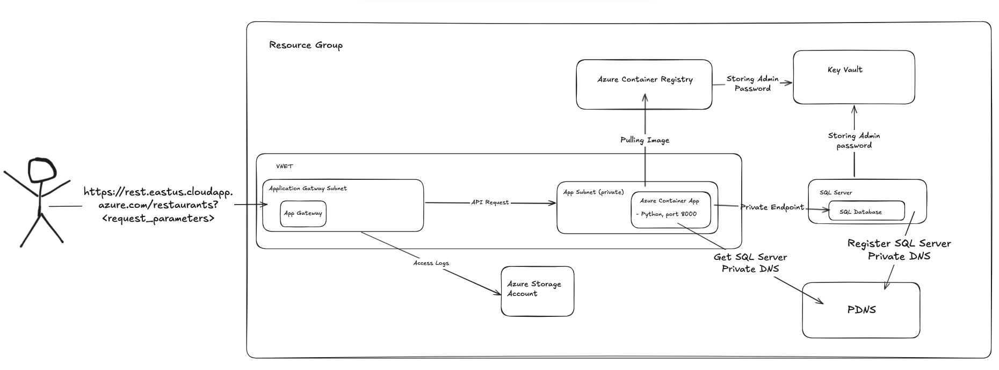

# Varonis Assignment
## Table of Contents

- [Project Structure](#project-structure)
- [Basic Architecture](#basic-architecture)


##  Project Structure
```sh
└── Varonis-Assignment/
    ├── .github
    │   └── workflows
    │       └── docker-publish.yml
    ├── README.md
    ├── api-code
    │   ├── Dockerfile
    │   ├── main.py
    │   └── requirements.txt
    ├── db-setup-code
    │   └── in.sql
    └── terraform
        ├── .gitignore
        ├── main.tf
        ├── modules
        │   ├── app_gw
        │   ├── azure_sql
        │   ├── container_app
        │   ├── docker_registry
        │   ├── key_vault
        │   ├── network
        │   ├── private_dns
        │   ├── resource_group
        │   ├── service_account
        │   └── storage_account_storage
        ├── outputs.tf
        └── provider.tf
```

## Basic Architecture
Basic diagram that shows the general flow of what resources I created and how they communicated with each other.


